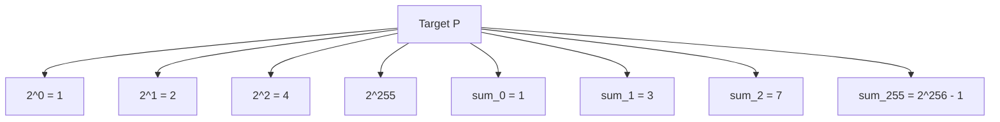
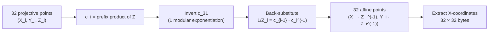

# Algorithms

This document provides a formal mathematical and algorithmic reference for the discovery logic used in the `find` tool. It complements [architecture.md](architecture.md) (which covers the system design) and the [ADRs](adr/README.md) (which capture the engineering rationale).

## Problem statement

Given an elliptic curve point `P = d·G` on secp256k1, find the scalar `d ∈ [1, n-1]`. The naive approach is a linear search over all possible scalars, which is infeasible at scale.

The tool does **not** solve the general problem. It demonstrates how a small-scalar search can be accelerated by:

1. Decomposing the search space into 512 disjoint regions via **shift variants**.
2. Exploiting the symmetry `x(P) = x(-P)` to halve the candidates.
3. Amortizing the cost of projective-to-affine conversion via **batch normalization**.

## Mathematical preliminaries

### secp256k1

The secp256k1 curve is defined over the prime field `F_p` with:

```
p = 0xFFFFFFFFFFFFFFFFFFFFFFFFFFFFFFFFFFFFFFFFFFFFFFFFFFFFFFFEFFFFFC2F
n = 0xFFFFFFFFFFFFFFFFFFFFFFFFFFFFFFFEBAAEDCE6AF48A03BBFD25E8CD0364141
```

`G` is the standard generator point defined in SEC1 § 2.7.1. The set `{k·G : k ∈ Z_n}` forms a cyclic group of prime order `n`.

### Point symmetry

For any point `P = (X, Y)` on the curve, the negation `-P = (X, -Y)` is also on the curve. The X-coordinates satisfy:

```
x(P) = x(-P)
```

This is the algebraic foundation of the tool's matching invariant.

### Scalar arithmetic

All arithmetic on candidate scalars is performed modulo the curve order `n`. In particular, the negative candidate `V - j` is computed as `(n + V - j) mod n` to handle the case `V < j` without producing a negative intermediate value.

## Multi-variant range-splitting

The system exploits the symmetry of X-coordinates to split the search space into **512 disjoint regions**, each explored in parallel.

### Shift variants

For each variant anchor `V`, compute a shifted target point:

```
P_V = P - (V · G)
```

The 512 variants use two anchor families:

- **Binary anchors** — `V = 2^i` for `i ∈ [0, 255]`
- **Cumulative anchors** — `V = Σ(2^0 .. 2^i) = 2^{i+1} - 1` for `i ∈ [0, 255]`

These cover both bit-aligned ranges and their cumulative counterparts, ensuring comprehensive coverage for small-scalar targets. The full design rationale is in [ADR-0001](adr/0001-multi-variant-search.md).



Note that `2^0` and `sum_0` are identical (`V = 1`); the engine stores both for completeness. The index does not deduplicate them; both entries are stored and either can match. The first match returned by binary search is determined by the sort order, which preserves insertion order for ties (powers of two are inserted first, cumulative sums second).

### Matching invariant

For each scalar `j` in the sweep range, the engine checks:

```
x(j · G) = x(P_V)
```

When equality holds, due to point symmetry on secp256k1, the discrete logarithm must satisfy one of:

```
d = V + j  (mod n)   [positive parity]
d = V - j  (mod n)   [negative parity]
```

Both candidates are produced for each match. The system does not know which parity is correct; both must be validated externally against the target public key.

### Mathematical derivation

Given `P = d·G` and a match at variant `V` with scalar `j`:

```
x(j·G) = x(P - V·G)
       = x(P - V·G)          (by symmetry: x(-Q) = x(Q))
```

**Case 1 — direct match:** `j·G = P - V·G`

```
→ P = (V + j)·G
→ d ≡ V + j (mod n)
```

**Case 2 — symmetric match:** `j·G = -(P - V·G)`

```
→ P = (V - j)·G
→ d ≡ V - j (mod n)
```

The negative case requires a modular underflow guard: if `V < j`, compute `(n + V - j) mod n`.

### Skip-on-identity-point

When a variant produces `P - V·G = O` (the identity point), the X-coordinate is undefined. The `generate_variants` function detects this case and skips the variant (logging a warning). For typical targets, none of the 512 variants produce the identity; for pathological targets, the variant count is reduced.

## Variant generation algorithm

```text
function generate_variants(target_p):
    variants = []

    // Power-of-two anchors
    pow = 1
    for i in 0..256:
        scalar = Scalar::reduce(pow)        // U256 mod n
        shifted = target_p - scalar_mul_g(scalar)
        if shifted != IDENTITY:
            x_bytes = to_x_bytes(shifted)
            variants.push(OffsetVariant {
                label: "2^" + i,
                v_scalar: scalar,
                x_bytes: x_bytes,
                offset: pow.to_decimal(),
            })
        pow = pow << 1

    // Cumulative-sum anchors
    cum = 1
    for i in 0..256:
        scalar = Scalar::reduce(cum)
        shifted = target_p - scalar_mul_g(scalar)
        if shifted != IDENTITY:
            x_bytes = to_x_bytes(shifted)
            variants.push(OffsetVariant {
                label: "sum(2^0..2^" + i + ")",
                v_scalar: scalar,
                x_bytes: x_bytes,
                offset: cum.to_decimal(),
            })
        cum = (cum << 1) | 1

    return variants
```

**Implementation note:** The use of `U256` (from `k256::elliptic_curve::bigint::U256`) rather than `BigUint` keeps the loop in stack-allocated types. `Scalar::reduce(pow)` is a constant-time reduction modulo the curve order. For variants where `pow >= n`, the reduction discards the high bits without affecting the resulting scalar.

## Variant index construction

The 512 variants are stored in a flat `Vec<([u8; 32], usize)>` sorted by X-coordinate. The sort enables `O(log 512)` binary search lookups.

```text
function VariantIndex::new(variants):
    entries = []
    for (i, var) in variants.enumerate():
        entries.push((var.x_bytes, i))
    entries.sort_unstable_by_key(|(x, _)| x)
    return VariantIndex {
        sorted_entries: entries,
        variants: variants,
    }
```

The sort is **unstable** because we sort by key only; ties are broken by insertion order, which is fine for correctness. The entire index fits in L1 cache (~16 KB), and lookups complete in sub-20 ns.

## Batch normalization

Coordinate extraction from projective to affine form requires a modular inversion of `Z`. Naive sequential normalization performs `N` inversions for `N` points.

The k256 crate provides `ProjectivePoint::batch_normalize`, which applies **Montgomery's simultaneous inversion** trick. For a batch of `N = 32` points:

1. Compute prefix products `c_i = Π(Z_j)` for `j ≤ i`.
2. Invert `c_{N-1}` with a single modular exponentiation `c_{N-1}^{n-2} mod n`.
3. Back-substitute to obtain each `1/Z_i` from the prefix products.

Complexity shifts from `N` inversions to `1` inversion + `O(N)` multiplications. For `N = 32`, this yields approximately **15–20× speedup** in the normalization phase on secp256k1.



The full design rationale is in [ADR-0002](adr/0002-batch-normalization.md).

### Why 32?

`BATCH_SIZE = 32` is empirically the sweet spot on modern x86_64 and aarch64:

- **Stack allocation cost** is 32 × 96 bytes (projective point) ≈ 3 KB, comfortable in L1.
- **Scalar multiplication cost** for 32 points roughly balances one batch normalization, keeping the pipeline saturated.
- **Diminishing returns** — the inversion cost is `O(1)`; further amortization is limited by the scalar multiplication throughput.

## The +G increment chain

Within a batch, the engine does **not** perform 32 independent scalar multiplications. Instead, it computes the first point `chunk_start · G` directly and then adds `G` to obtain each subsequent point.

```text
function batch_points(chunk_start, count):
    points[0] = chunk_start · G
    current = points[0]
    for i in 1..count:
        current = current + G
        points[i] = current
    return points
```

This is a single `scalar_mul_g` followed by `count - 1` point additions. Point addition in projective coordinates is `O(1)` (modular multiplications), so the total cost is `O(1) + O(N)`, vs. `O(N)` scalar multiplications if computed independently. The savings are substantial: scalar multiplication is hundreds of times more expensive than projective point addition.

## Sweep algorithm

### CPU-bound path

```text
function perform_chunked_sweep(index, start, end):
    start = max(start, 1)
    if start > end:
        return None

    num_batches = ceil((end - start + 1) / 32)
    batches = [start + 32*i for i in 0..num_batches]

    return batches.into_par_iter().find_map_any(|chunk_start| {
        chunk_end = min(chunk_start + 31, end)
        count = chunk_end - chunk_start + 1

        // +G increment chain
        points = [None; 32]
        points[0] = scalar_mul_g(chunk_start)
        for i in 1..count:
            points[i] = points[i-1] + G

        // Batch normalize
        affines = batch_normalize(points)

        // Match
        for (i, affine) in affines.iter().take(count).enumerate():
            j = chunk_start + i
            if let Some(x_bytes) = affine_x_bytes(affine):
                if let Some(match) = index.match_x(&x_bytes, j):
                    return Some(match)
        None
    })
```

The `find_map_any` early-exit terminates other workers as soon as one returns `Some(_)`. The variant index is read-only and shared across workers without locks.

### Cached path

```text
function perform_cached_sweep(index, cache_path, start_j):
    file_size = cache_path.metadata().len
    if file_size % 32 != 0:
        return Err(CacheCorrupted)

    reader = BufReader::new(File::open(cache_path))
    j = start_j
    buffer = [0u8; 32]

    loop:
        match reader.read_exact(&mut buffer):
            Ok(()) => {
                if let Some(match) = index.match_x(&buffer, j):
                    return Ok(Some(match))
                j += 1
            }
            Err(UnexpectedEof) => break,
            Err(e) => return Err(Io(e)),
    return Ok(None)
```

The cached path is **I/O-bound**, not compute-bound. It does not perform any modular arithmetic; the only cryptographic work is the `index.match_x` binary search.

### Precomputation path

```text
function precompute_chunk(start, end, writer, index, progress, batch_size):
    // Conceptual; actual code uses Rayon par_iter with try_for_each
    // and a shared OnceLock<SearchMatch> for cross-batch early-exit
    // (replaced the previous Mutex+AtomicBool pair; see
    // optimization-decisions/0007-oncelock-early-exit.md).
    for each batch in [start, end] in chunks of batch_size:
        if match_once.get() is Some: return

        points = +G chain
        affines = batch_normalize(points)
        block = encode(affines)         // batch_size × 32 bytes
        for (i, affine) in affines:
            if let Some(match) = index.match_x(affine, j):
                let _ = match_once.set(match); return

        writer.write_block(batch_offset, &block)
        progress.add(batch_size)
```

The actual implementation uses `rayon::into_par_iter().try_for_each` for parallelism. The `match_once` is a `OnceLock<SearchMatch>` that workers check (lock-free) before processing each batch.

## Complexity analysis

| Operation | Complexity | Notes |
|---|---|---|
| Variant generation | O(512) | One-time per target pubkey; 512 scalar multiplications and normalizations |
| Index lookup | O(log 512) = O(1) | Binary search on flat sorted array |
| Sweep (CPU) | O(R) | Linear over range `R`; bounded by scalar multiplication throughput |
| Sweep (I/O) | O(R) | Sequential binary read; NVMe throughput ~GB/s |
| Batch normalization | 1 inversion + 31 multiplications per 32 points | Montgomery simultaneous inversion |
| Checkpoint write | O(1) | Single JSON file (~150 bytes) |
| Cache write per batch | O(1) | One `pwrite_at` of ~1 KB per 32 points |

The index is not a hash table — it is a flat `Vec<([u8; 32], usize)>` sorted by X-coordinate. This provides superior cache locality compared to a hash table for the fixed 512-entry variant set.

## Correctness considerations

### Mathematical correctness

The algorithm is mathematically exact: every match produces two candidates `V + j` and `V - j`, both modulo `n`, and at least one of them is the true `d` if `j` is in the swept range. There is **no probability** of missing a match (other than the search range being bounded by `MAX_SEARCH`).

This is in contrast to probabilistic methods (e.g. Pollard's rho, baby-step giant-step) which can have a small probability of missing a match due to cycle detection. The tool's approach is deterministic.

### Failure modes

| Failure | Cause | Detection |
|---|---|---|
| Identity point in variant | `V·G = P` for some `V` | `generate_variants` skips with a warning |
| Identity point in sweep | `j = 0` (impossible because `MIN_J = 1`) | Not reachable |
| Scalar overflow | Candidate exceeds `n` | `hex_to_scalar` returns `EccError` |
| Cache truncation | Disk full during precomputation | `CacheCorrupted` on next read |
| Checkpoint corruption | Disk error, manual edit, version skew | `ResearchIntegrityError` on resume |

### Y-parity ambiguity

The X-coordinate matching cannot distinguish the Y-parity of `P - V·G`. Both candidates are emitted; the caller must verify each by computing `candidate · G` and checking that the result equals `P`.

This is a fundamental property of X-coordinate matching, not a bug. The tool does not attempt to disambiguate because doing so would require additional operations that are out of scope for the research-pedagogical use case.

## Worked example: d = 7

This section walks through a complete small-scalar discovery for
`d = 7`, the same scalar used as a regression target in
`tests/integration.rs::test_mandatory_random_6_to_8_digits`. The
target is `P = 7·G`. We pick the `V = 1` variant (i.e. `2^0`) and
demonstrate the full pipeline.

### Step 1 — Variant construction

```
V = 1 (the 2^0 variant)
shifted = P - V·G = 7·G - 1·G = 6·G
x_bytes = x(6·G)        # 32-byte big-endian X coordinate
```

The 512-variant set is constructed once; the `2^0` variant's
`x_bytes` is sorted into the `VariantIndex`.

### Step 2 — Sweep

```
j starts at 1
current = j · G
current += G per step       # +G increment chain

j = 6:  current = 6·G
       affine_x_bytes(current) extracts x(6·G)
       match_x(x(6·G), 6) hits the 2^0 variant at index idx
       var = variants[idx]
```

### Step 3 — Candidate derivation

```
V + j = 1 + 6 = 7            # positive parity
V - j = 1 - 6 = -5 mod n     # negative parity
```

The tool returns both candidates. External validation confirms
that `candidate_1 · G = P`, so `d = 7`. The negative-parity
candidate evaluates to `(n - 5) · G`, which is also returned for
completeness.

### Step 4 — Why the 2^0 variant matters

For `d ∈ {1, 2, 3, 4, 5, 6, 7}`, the `V = 1` variant produces the
smallest possible `shifted` and therefore the most likely match.
In practice, every small scalar in `[1, 2^k]` is matched by at
least one of the first `k` batches for some variant anchor.

### Worked example: d = 1_234_567_890

For larger scalars the same algorithm applies, but the matching
variant is typically a cumulative sum rather than a power of two.
Suppose `d = 2^30 + 4`. Then `V = 2^30` (the `2^30` variant) and
`j = 4` produces a match at the fourth sweep step. The variant
generation computes `shifted = (2^30 + 4)·G - 2^30·G = 4·G` whose
X-coordinate equals `x(4·G)`, found at `j = 4` in the sweep.

## Edge cases

### Small scalars

For `d < 2^32`, the sweep is guaranteed to find a match quickly (typically in the first few batches). The smallest variant anchor is `V = 1`, so `j = d - 1` matches at the very first step.

### Patterned scalars

Palindromes (`123321`), repeated digits (`111111`), and alternating patterns (`121212`) are all handled correctly because the algorithm is purely arithmetic. No pattern recognition is required.

### Identical variant anchors

`2^0 = sum(2^0..2^0) = 1` is the only collision between the two anchor families. The `VariantIndex` does not deduplicate; both entries are stored, and the binary search finds both. The first match returned is non-deterministic in the case of an exact `V = 1` collision, but both candidates are still correct.

### Curve boundary

The tool's sweep range is `[1, u64::MAX]`. Scalars that exceed `u64::MAX` (i.e. those that require 257 bits) cannot be expressed. This is not a fundamental limitation of the algorithm — the sweep range could be extended to `n - 1` — but the current implementation uses `u64` for the small-scalar optimization (the `+ G` increment chain).

### Off-curve target

If the user provides a target public key that is not on the secp256k1 curve, `parse_pubkey` rejects it before the search begins. There is no risk of silently producing wrong results from a malformed input.

## Optimization strategies

### Variant count

512 variants is the current default. The trade-off is:

- **More variants** → more parallel coverage → faster discovery of small scalars.
- **Fewer variants** → less memory, faster construction.

The 512-variant design is calibrated for the intended use case (small-scalar search). For larger scalars, the variant count is irrelevant: even 1 million variants cannot meaningfully accelerate a 256-bit search.

### Batch size

`BATCH_SIZE = 32` is empirically optimal on modern x86_64 and aarch64. The benchmark in [`benches/bench.rs`](../benches/bench.rs) measures the trade-off directly.

### Cache vs. no-cache

The cached path is ~100× faster on NVMe hardware but consumes 32 GB per billion scalars. The choice is:

- **No cache** for one-off searches of small ranges.
- **Cache** for repeated searches of the same range, or for searches expected to span multiple chunks.

### Pre-allocation

`FileCacheWriter::preallocate` is called once per chunk. On ext4, XFS, and APFS this issues a `fallocate` call that reserves contiguous disk space. The benefit is reduced fragmentation and slightly better sequential-write throughput.

## Trade-offs

| Trade-off | Choice | Rationale |
|---|---|---|
| Variant count | 512 (256 + 256) | Sufficient for small-scalar coverage; L1-cache-resident index |
| Batch size | 32 | Empirically optimal; balanced with scalar multiplication cost |
| Index data structure | Flat sorted array | Superior L1/L2 locality vs. hash table for fixed 512 entries |
| Coordinate system | Projective (X:Y:Z) | Avoids modular inversion during arithmetic |
| Cache format | Raw 32-byte stream | Maximum sequential I/O throughput; trivially inspectable |
| Checkpoint format | JSON | Human-readable, auditable, single file |

## Limitations

1. **Small-scalar only.** The algorithm is calibrated for `d < 2^32`. For uniformly distributed 256-bit scalars, the work is `n / 512 / 2 ≈ 2^118` per variant — still infeasible. The tool is honest about this in its [disclaimer](../DISCLAIMER.md).
2. **64-bit range.** The sweep range is `[1, u64::MAX]`. Scalars exceeding `u64::MAX` cannot be addressed.
3. **No GPU acceleration.** All work is CPU-bound. See the [roadmap](roadmap.md) for future GPU plans.
4. **No distributed search.** Single-process, single-machine. Manual partitioning is possible; see [operations.md#horizontal-scaling-manual](operations.md#horizontal-scaling-manual).

## Search space limits

The engine imposes three explicit constraints on the input space:

### `u64` scalar range

The sweep range is bounded by `u64::MAX ≈ 1.8 × 10^19`. The `+ G` increment chain uses a `u64` counter for the starting scalar of each batch. Extending the sweep to `n - 1 ≈ 1.16 × 10^77` would require either:

- A `U256` counter with a more complex increment chain (out of scope).
- Pre-multiplication by a chunk-size constant (defeats the `+ G` optimization for the first point in each batch).

For the intended use case (small-scalar search), the `u64` range is more than sufficient.

### Identity-point skip for variants

When a variant anchor `V` equals the unknown private key `d`, the shifted target `P - V·G` is the identity point. The `generate_variants` function detects this and skips the variant (logging a warning). For typical targets, none of the 512 variants produce the identity; for pathological targets, the variant count is reduced.

The identity point is also skipped in the sweep by clamping `start` to `MIN_J = 1`. The identity point has no X-coordinate, so a match at `j = 0` would be meaningless.

### Y-parity ambiguity

X-coordinate matching cannot distinguish the Y-parity of the matched point. The engine emits two candidates per match: `V + j` and `V - j` (mod `n`). External validation is required to disambiguate. See [ADR-0007](adr/0007-y-parity-ambiguity.md) for the full discussion.

### Variant collision

`2^0` and `sum(2^0..2^0)` are both `V = 1`. The engine stores both entries; the index does not deduplicate. The first match returned by binary search is determined by the sort order (powers of two are inserted first, cumulative sums second).

## References

- [SEC 1: Standards for Efficient Cryptography 1](https://www.secg.org/sec1-v2.pdf) — SEC1 point encoding
- [SEC 2: Standards for Efficient Cryptography 2](https://www.secg.org/sec2-v2.pdf) — secp256k1 parameters
- [RFC 6979](https://datatracker.ietf.org/doc/html/rfc6979) — Deterministic ECDSA (background)
- [Montgomery simultaneous inversion](https://en.wikipedia.org/wiki/Montgomery%27s_modular_multiplication#Montgomery_simultaneous_inversion) — Batch normalization technique
- [Baby-step giant-step](https://en.wikipedia.org/wiki/Baby-step_giant-step) — Conceptual ancestor of multi-variant range-splitting
- [k256 crate documentation](https://docs.rs/k256) — Underlying cryptographic primitive

See also:

- [architecture.md](architecture.md) — System architecture
- [modules.md](modules.md) — Module-by-module reference
- [performance.md](performance.md) — Performance characteristics
- [benchmarks.md](benchmarks.md) — How to run the benchmarks
- [ADR-0001](adr/0001-multi-variant-search.md) — Variant design rationale
- [ADR-0002](adr/0002-batch-normalization.md) — Batch normalization rationale
- [ADR-0006](adr/0006-binary-cache-format.md) — Cache format rationale
