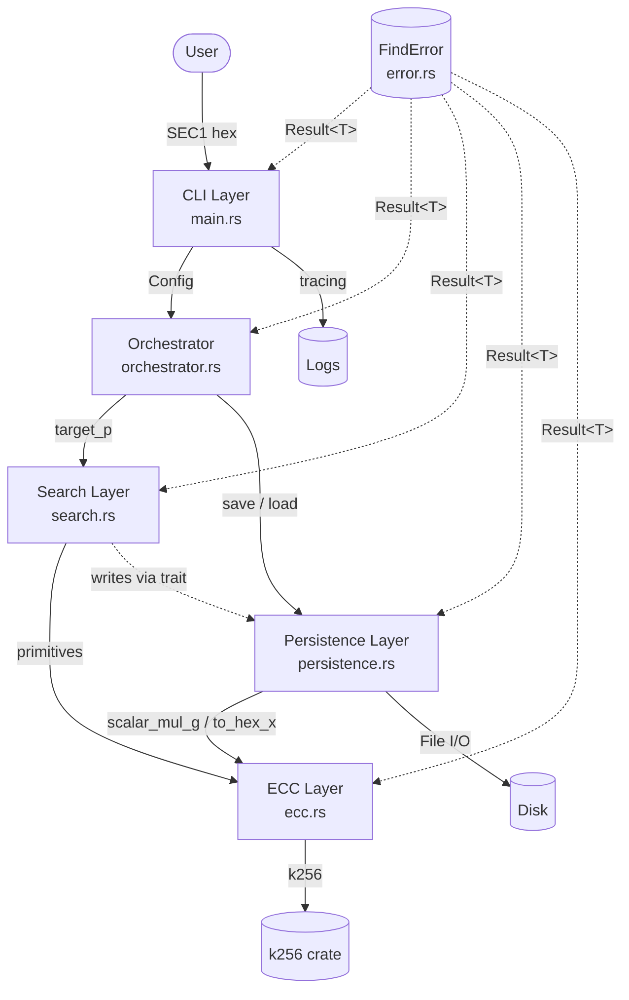
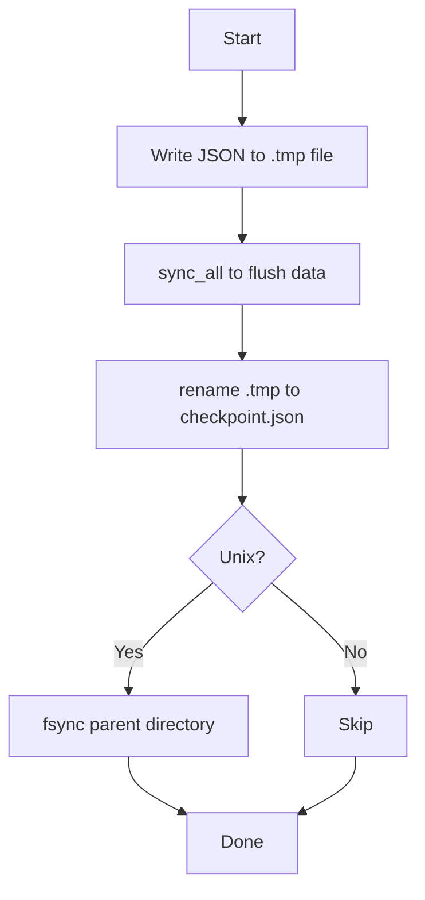
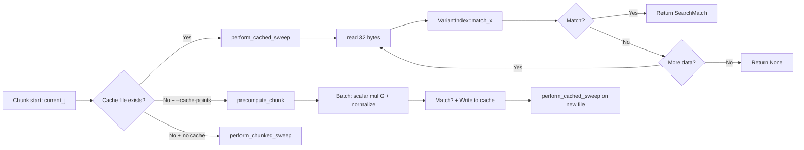
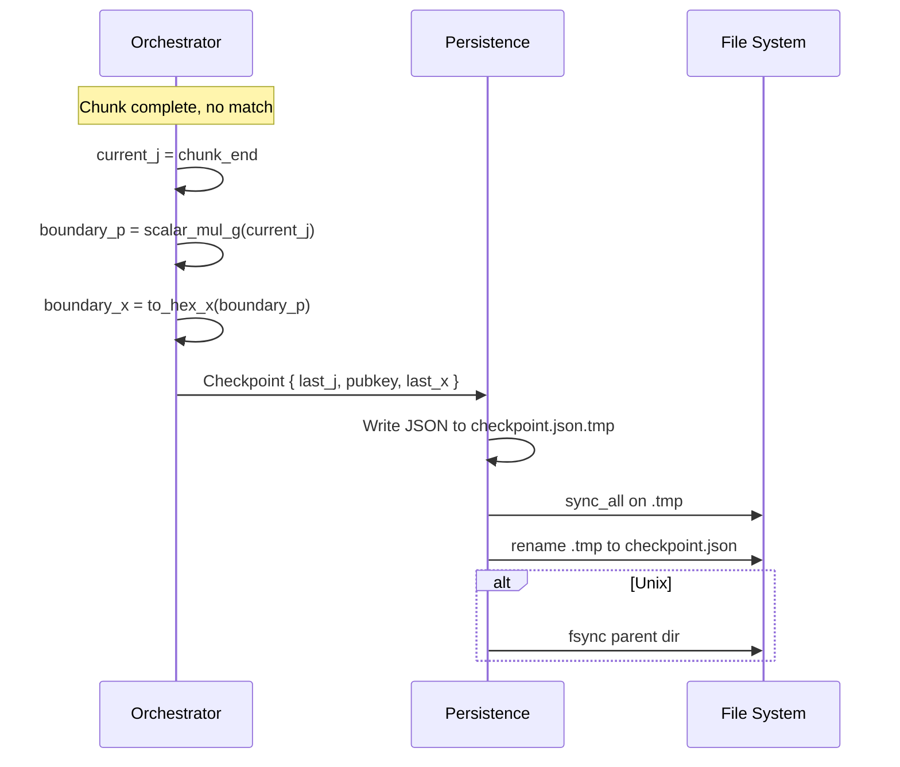
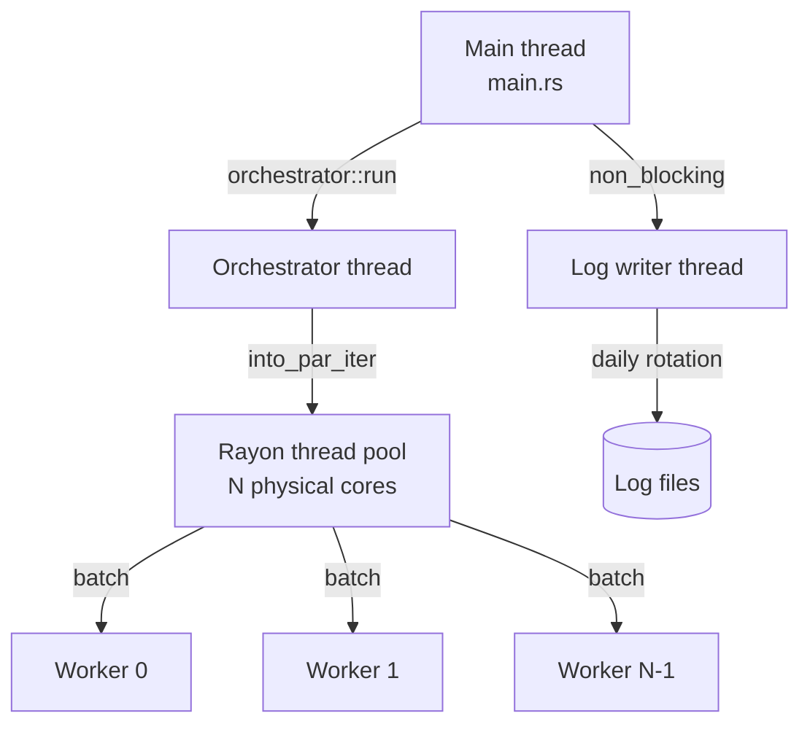

# Architecture

This document describes the system architecture of the `find` tool. It is the canonical reference for module responsibilities, data flow, persistence model, concurrency model, and extension points. For the mathematical foundations, see [algorithms.md](algorithms.md). For the engineering rationale behind each major decision, see the [ADRs](adr/README.md).

## Design philosophy

The system is built on three core pillars:

1. **Mathematical minimality.** Reducing cryptographic overhead by using projective coordinates, batch normalization, and pre-computed caches.
2. **Strict resilience.** Guaranteeing search state integrity through atomic I/O, integrity-anchored checkpoints, and non-blocking observability.
3. **High-throughput parallelism.** Leveraging work-stealing thread pools (`rayon`) to saturate all available CPU resources with early-exit on first match.

These pillars are operationalized through the layers described below. The decisions behind them are recorded as ADRs (see [ADR-0001](adr/0001-multi-variant-search.md), [ADR-0002](adr/0002-batch-normalization.md), [ADR-0003](adr/0003-atomic-checkpointing.md), [ADR-0008](adr/0008-mutex-poisoning-policy.md), [ADR-0009](adr/0009-runtime-batch-size.md)).

## Data layout

The runtime memory footprint, by layer:

| Component | Stack | Heap | Notes |
|---|---|---|---|
| `search::pow_of_two_g` | 256 × 96 B ≈ 24 KiB | — | Stack-allocated point-doubling table (used inside `generate_variants`) |
| `search::points[batch]` | — | `batch_size` × 96 B | **Heap-allocated** hot-path batch (commit 7b) |
| `search::affines[batch]` | — | `batch_size` × 96 B | **Heap-allocated** post-normalization (commit 7b) |
| `search::block[batch×32]` | — | `batch_size × 32` B | **Heap-allocated** cache write block |
| `search::VariantIndex::keys` | — | 16 KiB | L1-resident X-coords (`Vec<[u8; 32]>`) |
| `search::VariantIndex::order` | — | 4 KiB | Cold permutation (`Vec<usize>`) |
| `search::VariantIndex::variants` | — | static | `&'static [OffsetVariant]` slice taken from the interned `OnceLock<Box<[OffsetVariant; 512]>>` |
| `search::VariantIndex::x_bytes` | — | 16 KiB | Per-session target-specific keys |
| `persistence::BufReader` | — | 8 KiB default | I/O scratch (only used in the cached path) |
| Total | ~24 KiB / session | ~60 KiB / session | Heap usage dominated by 512-variant static intern + per-session `x_bytes` |

The previous `[T; MAX_BATCH]` stack-allocated arrays were removed in commit 7b.
See [ADR-0009](adr/0009-runtime-batch-size.md).

## System overview



Notable properties:

- **`error` has no internal dependencies** — every layer returns `Result<T, FindError>`.
- **`search` is pure** — it depends on `ecc` and the `CacheWriter` trait, not on the file system directly. See [ADR-0005](adr/0005-pure-search-module.md).
- **`persistence` implements `search::CacheWriter`** — the only layer that performs I/O.
- **`orchestrator` wires the layers together** — the only place where the lifecycle is owned.
- **`main` is a thin CLI wrapper** — argument parsing, tracing setup, and result rendering only.

## Layer-by-layer reference

### 1. CLI layer (`main.rs`)

**Responsibility:** Parse command-line arguments, initialize the tracing subscriber, delegate to the orchestrator, and render the result.

**Key functions:**

| Function | Purpose |
|---|---|
| `main()` | Process entry point; parses args, sets up Rayon, initializes tracing, runs the orchestrator |
| `init_tracing(&str)` | Configures the `tracing-subscriber` registry with a daily-rolling file appender and a stderr layer |
| `render_success_report(SearchMatch, Duration)` | Formats a `SearchMatch` into the human-readable success block (calls `m.candidates_hex()` to render the candidate private keys) |

**Notable design choices:**

- The `Args` struct is defined with `clap`'s `derive` macros; defaults are `output_dir = "data"`, `log_dir = "logs"`, `cache_points = false`, `batch_size = 32`, `variants = 512`.
- A custom Rayon `panic_handler` is installed that logs the panic via `tracing::error!` and returns rather than aborting. See [ADR-0005](adr/0005-pure-search-module.md) for why this matters.
- `--batch-size` and `--variants` flow through the fallible `Config::try_with_batch_size` / `Config::try_with_variant_count` builders; out-of-range values produce `FindError::InvalidConfig` and exit non-zero.
- The `tracing` subscriber is initialized with a `WorkerGuard` that is held for the lifetime of the process; dropping it at exit flushes buffered log events.

### 2. Orchestrator layer (`orchestrator.rs`)

**Responsibility:** Own the execution loop, manage the checkpoint lifecycle, and select the strategy (cached vs. compute-bound) per chunk.

**Key types and functions:**

| Item | Purpose |
|---|---|
| `Config` | Owned-string configuration: pubkey, output dir, cache flag, `BatchSize`, `variant_count` |
| `Config::validate() -> Result<()>` | Shallow check: pubkey non-empty / not whitespace-only |
| `Config::validate_pubkey() -> Result<()>` | Deep check: rounds the pubkey through `ecc::parse_pubkey`, raising `InvalidPublicKey` on any SEC1 failure (commit 3) |
| `Config::try_with_batch_size(u32) -> Result<Self, FindError>` | Fallible batch-size setter; returns `InvalidConfig` on out-of-range (commit 7a) |
| `Config::try_with_variant_count(u32) -> Result<Self, FindError>` | Fallible variant-count setter (commit 7a) |
| `Config::with_batch_size` / `with_variant_count` (deprecated) | Panicking setters retained for backward compat; `#[deprecated(note = "use try_with_* for fallible construction")]` |
| `run(&Config) -> Result<Option<SearchMatch>>` | Full session: parse → validate → generate variants → compute X-coords → load checkpoint → loop chunks → save checkpoint → return match |

**Internal constants:**

| Constant | Value | Purpose |
|---|---|---|
| `TRILLION` | `1_000_000_000_000` | Human-readable step size for audit-boundary logging |
| `DEFAULT_CACHE_CHUNK_SIZE` | `1_000_000_000` | Number of scalars per cache chunk (~32 GB of cache on disk) |
| `MAX_SEARCH` | `u64::MAX` | Theoretical upper bound of the search range |
| `MIN_J` | `1` | Minimum non-zero search scalar (the identity point is excluded) |

**Lifecycle of a `run` invocation (post-review):**

```mermaid
sequenceDiagram
    participant U as User
    participant O as Orchestrator
    participant S as Search
    participant P as Persistence
    participant FS as File System

    U->>O: run(&Config)
    O->>O: Config::validate() (shallow)
    O->>O: Config::validate_pubkey() (deep, ecc::parse_pubkey)
    O->>S: generate_variants(&target_p) -> &'static [OffsetVariant; 512]
    O->>S: compute_variant_x_bytes(&target_p) -> Vec<[u8; 32]>
    O->>P: save_variants_to_json(metas, &x_bytes, dir)
    P->>FS: write data/points.json
    O->>P: Checkpoint::load
    alt checkpoint valid + pubkey match
        O->>P: cp.verify(pubkey)
        Note over O: current_j = cp.last_j
    else mismatch or missing
        Note over O: current_j = 0
    end
    loop per chunk
        O->>FS: check chunk_<start_j>.bin
        alt cache hit
            O->>P: perform_cached_sweep
        else cache miss + --cache-points
            O->>S: precompute_chunk(.., batch_size)
            S->>P: CacheWriter::write_block
            O->>P: perform_cached_sweep
        else cache miss + no --cache-points
            O->>S: perform_chunked_sweep(.., batch_size)
        end
        alt match found
            S-->>O: Some(SearchMatch { candidates: [Scalar; 2], .. })
            O-->>U: Ok(Some(m))
        else no match
            O->>P: Checkpoint::save_atomic
            P->>FS: write-then-rename checkpoint.json
        end
    end
    O-->>U: Ok(None)
```

**Key behaviors:**

- The orchestrator never directly computes ECC. All cryptographic work is delegated to `search::perform_chunked_sweep` or `precompute_chunk`, both of which take `batch_size: u32` from `Config::batch_size`.
- The checkpoint is written **only** when a chunk completes without a match. If a match is found, the checkpoint write is skipped.
- The chunk loop uses `saturating_add` for `current_j + CACHE_CHUNK_SIZE`; if saturation is detected, the loop exits with "Search space exhausted (overflow detected)".
- `generate_variants` returns a `&'static [OffsetVariant]` slice backed by a process-wide `OnceLock`. The first call pays the 512-entry construction cost; subsequent calls in the same process (different target pubs) are free.
- The two validations (`validate` and `validate_pubkey`) both run at the very top of `run`. Out-of-range `--batch-size` / `--variants` are rejected by `try_with_*` in `main` before `Config` is ever constructed.

### 3. Search layer (`search.rs`)

**Responsibility:** Implement the multi-variant range-splitting engine. Pure: no I/O, no global state, no platform-specific code. All side effects (cache writes, progress updates) are injected via explicit arguments.

**Public items:**

### Structs

| Item | Purpose |
|---|---|
| `OffsetVariant` | A single shift variant: label, scalar offset `v_scalar: Scalar`, decimal offset string. Does **not** carry an X-coordinate (commit 7c) — the target-specific X-coordinates live in the parallel array returned by `compute_variant_x_bytes`. |
| `VariantIndex` | Cache-optimized lookup index: a sorted `Vec<[u8; 32]>` of X-coordinates + a `Vec<usize>` permutation + a `&'static [OffsetVariant]` slice borrowed from the interned metadata + a per-session `Vec<[u8; 32]>` of keys. Constructed via `VariantIndex::new(variants: &'static [OffsetVariant], x_bytes: &[[u8; 32]])`. |
| `SearchMatch` | The result of a successful match (label, offset string, small scalar `j`, `candidates: [Scalar; 2]`). Has `candidates_hex()` and `candidates_as_scalars()` accessors (commit 12). |
| `Progress` | Thread-safe `AtomicU64` counter for telemetry |

### Traits

| Item | Purpose |
|---|---|
| `CacheWriter` | Object-safe trait for writing raw 32-byte X-coordinate blocks at arbitrary offsets |

### Functions

| Item | Purpose |
|---|---|
| `generate_variants(&ProjectivePoint) -> &'static [OffsetVariant]` | Returns the interned 512-variant metadata (label / scalar / decimal-offset) taken from a per-process `OnceLock<Box<[OffsetVariant; 512]>>` (commit 7c). Calls are essentially free on the happy path. |
| `compute_variant_x_bytes(&ProjectivePoint) -> Vec<[u8; 32]>` | Computes the target-specific X-coordinates (256+256 scalar multiplications or mixed additions). Pair with `generate_variants` to build a `VariantIndex`. |
| `perform_chunked_sweep(&VariantIndex, start, end, batch_size) -> Option<SearchMatch>` | CPU-bound parallel sweep; honours `batch_size` from `Config::batch_size` (commit 7b) |
| `precompute_chunk(start, end, &W, Option<&VariantIndex>, &Progress, batch_size) -> Result<Option<SearchMatch>>` | Pre-computes a binary cache chunk while optionally searching for a match; takes the same `batch_size` arg |

**Performance characteristics:**

- `BatchSize::DEFAULT.get() = 32` points per batch normalization, with `BatchSize::MAX = 256`. See [ADR-0002](adr/0002-batch-normalization.md) (the algorithm) and [ADR-0009](adr/0009-runtime-batch-size.md) (the runtime sizing).
- Hot-path arrays (`points`, `affines`, `block`) are **heap-allocated** (`Vec<T>`) and sized at runtime against `Config::batch_size`. The previous compile-time-bounded stack allocation (`[T; MAX_BATCH]`) is gone. See [ADR-0009](adr/0009-runtime-batch-size.md).
- Within a batch, the `+ G` increment chain is used (rather than `N` independent scalar multiplications). For batch start `chunk_start`, the first point is `chunk_start · G` and each subsequent point is `+ G`. This is `~N×` faster than per-point scalar multiplication.
- `rayon::find_map_any` provides early-exit on the first match.
- The `VariantIndex` reference is shared immutably across all workers; no locks are required because the index is read-only after construction.
- `generate_variants` is essentially free on the happy path: the 512-entry metadata is built once per process in a `OnceLock`. Only the per-session `compute_variant_x_bytes` arithmetic is paid.

**`precompute_chunk` cross-batch coordination:**

`precompute_chunk` uses a `OnceLock<SearchMatch>` shared across batches (replacing the previous `Mutex<Option<SearchMatch>>` + `AtomicBool` pair — see [optimization-decisions/0007](../optimization-decisions/0007-oncelock-early-exit.md)). Each batch:

1. Reads the `OnceLock` (lock-free) to check whether another batch has already published a match.
2. If yes, returns immediately (no work done).
3. If no, processes the batch and writes the X-coordinates via the `CacheWriter`.
4. If a match is discovered, publishes it via `OnceLock::set`; later workers' `set` calls are no-ops.
5. The orchestrator's outer loop then extracts the published match via `OnceLock::into_inner`.

Because `OnceLock` has no mutex, no poisoning recovery is needed — there is no lock for a panicked worker to corrupt.

### 4. Persistence layer (`persistence.rs`)

**Responsibility:** All I/O side effects — atomic checkpoints, binary cache files, JSON variant exports. This module contains the **only** reviewed `unsafe` block in the entire codebase (the `libc::fsync` call in `save_atomic`; see [security.md](security.md)).

**Public items:**

| Item | Purpose |
|---|---|
| `Checkpoint` | Durable state: `last_j`, `pubkey`, `last_x` (integrity anchor) |
| `Checkpoint::load(&Path) -> Result<Self>` | Read a checkpoint from a JSON file |
| `Checkpoint::verify(&str) -> Result<()>` | Verify the integrity anchor against the recalculated X-coordinate |
| `Checkpoint::save_atomic(&Path) -> Result<()>` | Write the checkpoint via write-then-rename with parent-dir `fsync` on Unix |
| `FileCacheWriter` | Cross-platform binary cache writer (implements `CacheWriter`) |
| `FileCacheWriter::create(&Path) -> Result<Self>` | Create a new cache file (and parent directories) |
| `FileCacheWriter::preallocate(u64) -> Result<()>` | Pre-allocate the file to the given length |
| `perform_cached_sweep(&VariantIndex, &Path, start_j) -> Result<Option<SearchMatch>>` | I/O-bound search against a pre-computed cache |
| `save_variants_to_json(variants: &[OffsetVariant], x_bytes: &[[u8; 32]], dir_path: &str) -> Result<String>` | Export variant metadata to `points.json` (commit 7c added the `x_bytes` parameter) |

**Atomic persistence pattern (`save_atomic`):**



The rename is atomic on POSIX-compliant file systems (ext4, XFS, APFS, NTFS). The parent-directory `fsync` on Unix closes a subtle durability gap: most file systems require the directory entry to be flushed for the rename to survive a crash.

**Cross-platform `FileCacheWriter::write_block`:**

| Platform | Mechanism | Notes |
|---|---|---|
| Unix | `pwrite_at(data, offset)` via `std::os::unix::fs::FileExt` | Atomic at any offset; no locking required |
| Other | `seek(SeekFrom::Start(offset))` + `write_all(data)` under `Mutex<File>` | Lock contention is negligible (one ~1 KB write per batch) |

**Cache file format** (see [ADR-0006](adr/0006-binary-cache-format.md) for full details):

```
+----------------+----------------+----------------+-----+----------------+
| x(start·G)[..]  | x((start+1)·G) | x((start+2)·G) | ... | x(end·G)[..]  |
+----------------+----------------+----------------+-----+----------------+
       32 bytes      32 bytes         32 bytes             32 bytes
```

- Total size = `(end - start + 1) × 32` bytes.
- No header or footer; metadata is in the filename (`chunk_<start_j>.bin`).
- Big-endian X-coordinate encoding matches SEC1.
- File size must be a multiple of 32 bytes; otherwise `CacheCorrupted` is raised.

**`perform_cached_sweep` buffer:** the per-batch inner loop reads 32 bytes at a time using a `CACHED_SWEEP_BUF_SIZE`-byte stack scratch buffer (default 32 KiB) rather than allocating per-batch `Vec<u8>`s. Each batch of 32 bytes is copied out via `copy_from_slice` (commit 13).

### 5. ECC layer (`ecc.rs`)

**Responsibility:** Thin wrapper over `k256` that exposes a search-oriented API. All operations enforce SEC1 compliance and strict scalar range validation.

**Public items:**

| Item | Purpose |
|---|---|
| `parse_pubkey(&str) -> Result<ProjectivePoint>` | Parse a hex-encoded SEC1 public key |
| `generator() -> ProjectivePoint` | Return the secp256k1 generator point `G` |
| `hex_to_scalar(&str) -> Result<Scalar>` | Convert hex to `Scalar`, reducing modulo `n` |
| `scalar_mul_g(&Scalar) -> ProjectivePoint` | Compute `d·G` via fixed-base scalar multiplication |
| `subtract(&ProjectivePoint, &ProjectivePoint) -> ProjectivePoint` | Compute `P - Q` in projective coordinates |
| `to_hex_x(&ProjectivePoint) -> String` | Extract the 32-byte hex X-coordinate (identity-safe) |

**Coordinate system:** points are stored in **projective coordinates** during arithmetic and only converted to affine form during batch normalization. The `to_hex_x` function performs the per-point conversion via `AffineCoordinates::x()` (commit 5 — drops the `to_encoded_point + EncodedPoint::x()` round-trip) and is used by the orchestrator for the checkpoint integrity anchor.

### 6. Error model (`error.rs`)

**Responsibility:** Single error type returned by every fallible function. See [ADR-0004](adr/0004-error-hierarchy.md).

| Variant | Subsystem |
|---|---|
| `EccError(String)` | ECC arithmetic failures |
| `ResearchIntegrityError(String)` | Checkpoint anchor mismatch |
| `InvalidPublicKey(String)` | SEC1 parsing failures |
| `InvalidConfig(String)` | `Config::try_with_batch_size` / `try_with_variant_count` out-of-range (commits 3 + 7a) |
| `Io(std::io::Error)` | File-system operations |
| `HexError(hex::FromHexError)` | Hex decoding |
| `SerializationError(serde_json::Error)` | JSON serialization |
| `CacheCorrupted(String)` | Binary cache validation |

The `Result<T>` type alias is used throughout the crate: `pub type Result<T> = std::result::Result<T, FindError>;`.

## Data flow

### Search pipeline (CPU-bound path)

```mermaid
graph LR
    A[User: --pubkey HEX] --> B[ecc::parse_pubkey]
    B --> C[search::generate_variants<br/>returns &'static [OffsetVariant; 512]<br/>via OnceLock]
    B2[search::compute_variant_x_bytes<br/>returns Vec<[u8; 32]>] --> D
    C --> D[VariantIndex::new(variants, &x_bytes)<br/>sort by X]
    D --> E[Search loop per chunk]
    E --> F[perform_chunked_sweep(.., batch_size)]
    F --> G[Vec with capacity batch_size<br/>scalar mul G + chain]
    G --> H[batch_normalize<br/>1 inversion + (batch_size - 1) muls]
    H --> I[VariantIndex::match_x<br/>O log 512 binary search]
    I --> J{Match?}
    J -->|Yes| K[Build SearchMatch { candidates: [Scalar; 2] }]
    K --> L[Return Some(m)]
    J -->|No| M[Save checkpoint]
    M --> E
```

### Search pipeline (cached path)



### Checkpoint flow



On resume:

```mermaid
sequenceDiagram
    participant O as Orchestrator
    participant P as Persistence
    participant FS as File System

    O->>P: Checkpoint::load
    P->>FS: read checkpoint.json
    P-->>O: Checkpoint { last_j, pubkey, last_x }
    alt pubkey matches
        O->>P: cp.verify(current_pubkey)
        P->>O: recompute last_j · G X-coordinate
        P->>P: compare to last_x
        alt match
            Note over O: Resume from last_j + 1
        else mismatch
            O-->>O: ResearchIntegrityError → refuse to proceed
        end
    else pubkey differs
        Note over O: Different search; start fresh
    end
```

## Concurrency model

### Thread topology



- The main thread is the orchestrator; it is blocked on `orchestrator::run` for the duration of the search.
- The Rayon thread pool is sized to the number of physical cores by default. Each worker processes one batch at a time.
- The `tracing` non-blocking writer runs on a dedicated OS thread owned by `tracing_appender`. It is decoupled from the orchestrator and worker threads.

### Synchronization primitives

| Primitive | Location | Purpose |
|---|---|---|
| `AtomicU64` (Relaxed) | `search::Progress` | Telemetry counter; relaxed ordering is sufficient because the value is informational |
| `OnceLock<SearchMatch>` | `search::precompute_chunk` | Cross-batch one-shot match publication (replaces the `Mutex<Option<SearchMatch>>` + `AtomicBool` pair from 0.1.6; commit 6 + see [optimization-decisions/0007](../optimization-decisions/0007-oncelock-early-exit.md)) |
| `OnceLock<Box<[OffsetVariant; 512]>>` | `search::generate_variants` | Per-process interning of the 512-entry variant metadata (replaces 512 `format!` + 256+256 `u256_to_decimal` allocations per session; commit 7c) |
| `Mutex<File>` | `persistence::FileCacheWriter` (non-Unix only) | Serializes `seek + write_all` on platforms without `pwrite_at`. **The only remaining `Mutex` in the codebase** after commit 6. |
| `tracing` non-blocking writer | `main::init_tracing` | Decouples log I/O from the CPU path |

### Early-exit semantics

`rayon::find_map_any` provides a clean early-exit: when any worker returns `Some(_)`, the remaining workers' batches are abandoned and the result is returned. The behavior is documented in the [`rayon` documentation](https://docs.rs/rayon).

The custom panic handler in `main.rs` allows a worker panic to be recovered: the panic is logged, and the search continues with the remaining workers. The search hot path uses `OnceLock<SearchMatch>` for cross-batch coordination, which has **no mutex** to poison; the only `Mutex` left in the application (the non-Unix `FileCacheWriter` fallback) is in `src/persistence.rs`.

## Persistence architecture

### Filesystem layout

```
data/
├── checkpoint.json              # Single durable checkpoint
├── points.json                  # Variant metadata (X → offset)
└── checkpoints/
    ├── chunk_1.bin              # Cache for j ∈ [1, 1_000_000_000]
    ├── chunk_1000000001.bin     # Cache for j ∈ [1_000_000_001, 2_000_000_000]
    └── ...

logs/
├── find.log.2026-04-12          # Daily-rolling log file
├── find.log.2026-04-13
└── ...
```

### Write durability

| File | Durability mechanism | Crash behavior |
|---|---|---|
| `checkpoint.json` | Write-then-rename with parent-dir `fsync` (Unix) | A crash before the rename leaves the previous valid checkpoint intact |
| `chunk_*.bin` | `pwrite_at` (Unix) or seek+write (other) per batch | A crash mid-chunk leaves a partial file; the size check rejects it on next read |
| `points.json` | `fs::write` (not atomic) | A crash mid-write may leave a partial JSON; the tool re-generates on each run |
| `find.log.*` | `tracing_appender::non_blocking` buffered writer | A crash may lose up to one buffer's worth of events |

### Recovery procedure

On startup, the orchestrator:

1. Reads `checkpoint.json` if it exists.
2. If the pubkey matches the current run, verifies the integrity anchor.
3. Resumes from `last_j + 1` if valid; starts from `1` if the pubkey differs or the file is missing.

If verification fails, the process exits with `ResearchIntegrityError`. The user must delete `checkpoint.json` and restart.

## Security architecture

See [security.md](security.md) for the full security model. The architecture-level points:

- **One reviewed `unsafe` call** in application code (`libc::fsync` in `persistence.rs`); no other application-code `unsafe`. This was the case at 0.1.6 and remains true after the review-driven pass:
  - commit 1 removed the `unsafe { String::from_utf8_unchecked }` block in `u256_to_decimal` (commit 1);
  - commit 6 migrated `precompute_chunk` off `Mutex<Option<SearchMatch>>` + `AtomicBool` to a single `OnceLock<SearchMatch>`, eliminating the need for poison handling;
  - commit 10 added a curated `[lints.clippy]` (pedantic + nursery) gate with a documented allow-list, encouraging future contributors to reach for safe alternatives.
- **Atomic state persistence** via write-then-rename and parent-directory `fsync` (with a tightened three-clause `// SAFETY:` block per commit 2).
- **Input validation** at the boundary: `Config::validate` (shallow) + `Config::validate_pubkey` (deep, delegates to `ecc::parse_pubkey`). `Config::try_with_*` builders reject out-of-range `--batch-size` / `--variants` as `FindError::InvalidConfig`.
- **No network I/O** — the tool does not require or use the network.
- **Dependency auditing** via `cargo audit` and `cargo deny` in CI.
- **Miri for unsafe changes** — `cargo +nightly miri test --workspace --all-features` runs on every PR (CI) and is required for any PR that modifies `unsafe`.

## Extension points

| Extension | Mechanism |
|---|---|
| Custom cache storage | Implement `search::CacheWriter` and pass it to `precompute_chunk` |
| Custom progress reporting | Pass a custom `search::Progress` (or any type with the same `add`/`get` shape) |
| Custom variant generation | Construct `search::OffsetVariant` instances directly and build a `VariantIndex` |
| Custom session control | Call `search::perform_chunked_sweep` directly; bypass the orchestrator entirely |
| Custom error handling | Match on `FindError` variants in the `Result` return type |

The `CacheWriter` trait is **object-safe** (`Send + Sync` supertraits, no generics), enabling dynamic dispatch and runtime writer selection.

## Performance characteristics

| Operation | Complexity | Notes |
|---|---|---|
| Variant generation | O(512) | One-time per target pubkey |
| Index lookup | O(log 512) = O(1) | Flat array, L1-resident |
| Sweep (CPU) | O(R) | Linear over range `R` |
| Sweep (cached) | O(R) | Disk-bandwidth bound |
| Batch normalization | 1 inversion + 31 multiplications per 32 points | See [ADR-0002](adr/0002-batch-normalization.md) |

See [performance.md](performance.md) for the full performance guide and [benchmarks.md](benchmarks.md) for benchmark instructions.

## See also

- [algorithms.md](algorithms.md) — Mathematical foundation
- [modules.md](modules.md) — Module-by-module reference
- [cli.md](cli.md) — Command-line interface
- [observability.md](observability.md) — Tracing and logging
- [security.md](security.md) — Security model
- [glossary.md](glossary.md) — Terms and abbreviations (including `BatchSize`, `OnceLock`, `SearchMatch`)
- [ADRs](adr/README.md) — Architectural decision records (0001–0009)
