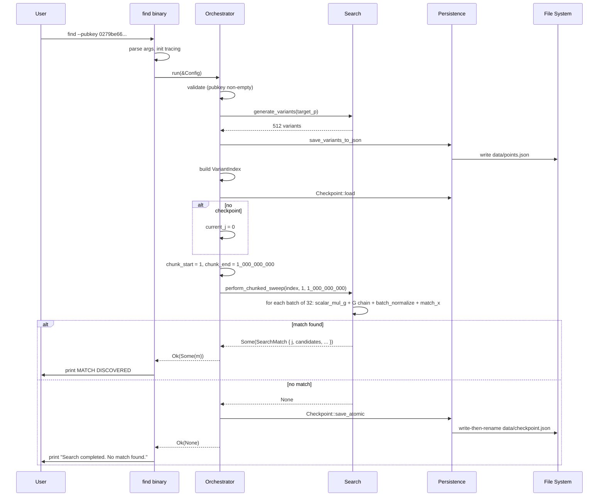

# Getting Started — First Search Walkthrough

This document is a guided walkthrough of your first search with the `find` tool. For installation instructions, see the [README](../README.md). For the full CLI reference, see [cli.md](cli.md).

## Prerequisites

- **Rust:** 1.70 or later (install via [rustup](https://rustup.rs/))
- **Operating System:** Linux, macOS, or Windows
- **Storage:** At least 32 GB free if using binary caching
- **Git:** for cloning the repository

## Step 1: Clone and build

```bash
git clone https://github.com/sachncs/find.git
cd find
cargo build --release
```

The binary is produced at `target/release/find` (or `find.exe` on Windows).

## Step 2: Run a basic search

The tool requires a SEC1-encoded public key. The Bitcoin secp256k1 generator point's compressed public key is a safe target for a smoke test:

```bash
./target/release/find --pubkey 0279be667ef9dcbbac55a06295ce870b07029bfcdb2dce28d959f2815b16f81798
```

This runs a CPU-bound parallel sweep without writing any cache files. The first run is dominated by the 512-variant construction; subsequent runs are faster.

You will see output similar to:

```
2026-04-12T10:23:45.123Z INFO find::orchestrator: --- STARTING SEGMENT [1 ... 1000000000] ---
2026-04-12T10:23:45.456Z INFO find::orchestrator: Cache miss. Running parallel sweep...
```

For small target scalars (less than a billion), the search typically completes in seconds. For larger scalars, the search continues until the space is exhausted or a match is found.

## Step 3: Understand the output

When a match is found:

```
============================================================
MATCH DISCOVERED (Variant: 2^10)
Shift scalar V: 1024
Search scalar j: 42
Target candidates (d = V +/- j):
  [1] 0x426
  [2] 0x3e2
Total Search Duration: 2.345s
============================================================
```

The two candidates (`V + j` and `V - j`) are hex-encoded private keys. Verify each by computing `candidate · G` and checking that the result equals the target public key.

If no match is found in the swept range:

```
Search completed. No match found.
```

## Step 4: With binary caching

To accelerate repeated searches of the same range, enable binary caching:

```bash
./target/release/find --pubkey 0279be66... --cache-points
```

This precomputes a 32 GB cache file per billion scalars. The first run takes longer (it must write the cache), but subsequent runs against any public key reuse the cache.

The cache is written to `data/checkpoints/chunk_<start_j>.bin`. See [ADR-0006](adr/0006-binary-cache-format.md) for the file format.

## Step 5: Resume an interrupted search

The tool automatically checkpoints progress. If the search is interrupted (Ctrl-C, crash, power loss), the next run resumes from the last checkpoint:

```bash
# First run (interrupted)
./target/release/find --pubkey 0279be66...
^C

# Second run (resumes)
./target/release/find --pubkey 0279be66...
```

The resume behavior is:

1. Read `data/checkpoint.json`.
2. If the pubkey matches, verify the integrity anchor (the X-coordinate of `last_j · G`).
3. If valid, resume from `last_j + 1`.
4. If the pubkey differs, start a fresh search (with a warning).
5. If the anchor is invalid, refuse to proceed with `ResearchIntegrityError`.

See [ADR-0003](adr/0003-atomic-checkpointing.md) for the checkpoint design.

## Sequence diagram: a typical first run



## Files produced

A typical first run produces:

| File | Purpose |
|---|---|
| `data/points.json` | Variant metadata (X-coordinate → offset) |
| `data/checkpoint.json` | Progress checkpoint |
| `logs/find.log.YYYY-MM-DD` | Daily-rolling log file |

If `--cache-points` is enabled, additionally:

| File | Purpose |
|---|---|
| `data/checkpoints/chunk_<start_j>.bin` | Binary cache for the swept range |

## Next steps

- Read [architecture.md](architecture.md) for the system design.
- Review [algorithms.md](algorithms.md) for the mathematical foundation.
- Check [cli.md](cli.md) for the full flag reference.
- See [operations.md](operations.md) for backup, monitoring, and scaling.
- Read [troubleshooting.md](troubleshooting.md) if anything goes wrong.

## Common issues

### Build fails

Ensure Rust 1.70+ is installed:

```bash
rustc --version
rustup update
```

### Out of memory

Binary caching requires significant memory for the precomputation phase. Reduce the cache chunk size or avoid caching for very large searches. See [configuration.md#compile-time-constants](configuration.md#compile-time-constants).

### Checkpoint corruption

If you encounter checkpoint errors, delete the `data/checkpoint.json` file and restart the search:

```bash
rm data/checkpoint.json
./target/release/find --pubkey 0279be66...
```

For more issues, see [troubleshooting.md](troubleshooting.md) or open an issue on GitHub.

## See also

- [README.md](../README.md) — Project overview, installation, quick start
- [architecture.md](architecture.md) — System design
- [algorithms.md](algorithms.md) — Mathematical foundation
- [cli.md](cli.md) — Full CLI reference
- [configuration.md](configuration.md) — Environment variables and constants
- [troubleshooting.md](troubleshooting.md) — Operational issues
- [operations.md](operations.md) — Runbook
