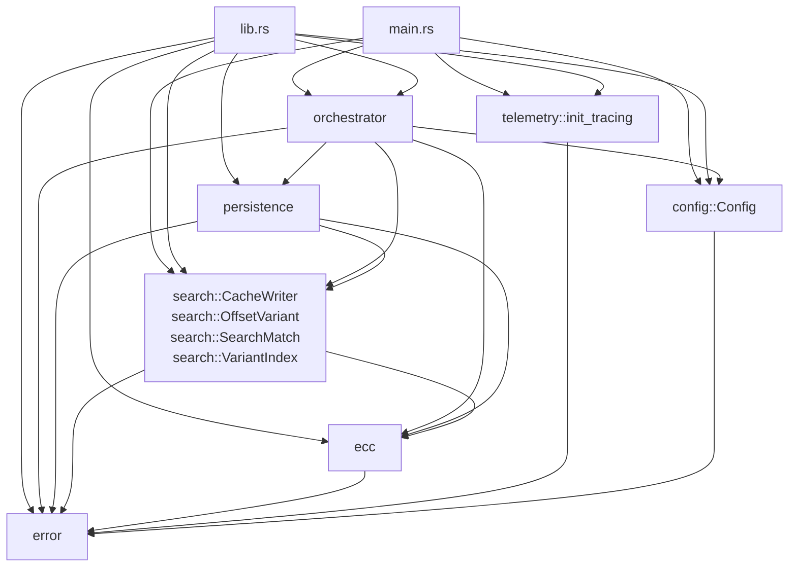

# Modules

The `find` crate is organized into eight modules with clear responsibility boundaries. This document provides a module-by-module reference and complements the rustdoc generated by `cargo doc`.

## Crate structure

```
find/
├── lib.rs           # Crate root; #![warn(missing_docs)] + #![warn(rustdoc::broken_intra_doc_links)]
├── main.rs          # CLI binary entry point
├── config.rs        # Config, BatchSize newtype, validation, MAX_BATCH_SIZE, MAX_VARIANT_COUNT
├── telemetry.rs     # Tracing subscriber + Rayon panic handler
├── error.rs         # FindError (8 variants) + Result alias
├── ecc.rs           # SEC1 parsing, point arithmetic, hex conversion, to_hex_x
├── search.rs        # Pure domain: VariantIndex, OffsetVariant, generate_variants,
│                   #   compute_variant_x_bytes, sweep_parallel, sweep_and_cache,
│                   #   CacheWriter trait, Progress
├── persistence.rs   # Checkpoint save/load, BinaryCacheWriter, sweep_cached,
│                   #   write_variants_json (the only libc::fsync unsafe lives here)
└── orchestrator.rs  # run(&Config) entry point + checkpoint/lifecycle loop
```

## Module dependency graph



Notable properties:

- **`error` has no internal dependencies** — it is the leaf of the dependency graph.
- **`ecc` depends only on `error` and external crates** (`k256`).
- **`search` depends on `ecc` and `error`** but is otherwise pure (no I/O). See [ADR-0005](adr/0005-pure-search-module.md).
- **`persistence` implements `search::CacheWriter`** and is the only module that does file I/O.
- **`orchestrator` wires everything together** and is the entry point for library users.
- **`main` is a thin CLI wrapper**; all logic lives in `orchestrator`.

## `lib.rs` — crate root

The crate root re-exports the public modules and provides the high-level documentation. Library users should import from `find::` (the crate root), not from the individual module paths.

```rust
pub mod ecc;
pub mod error;
pub mod orchestrator;
pub mod persistence;
pub mod search;
```

The crate enables `#![warn(missing_docs)]`, so any undocumented public item is a build warning.

## `error` — error model

**File:** `src/error.rs`

**Purpose:** Defines [`FindError`](../src/error.rs), the single error type returned by every fallible function in the crate. See [ADR-0004](adr/0004-error-hierarchy.md) for the rationale.

**Public items:**

| Item | Description |
|---|---|
| `FindError` | The unified error enum with eight variants |
| `Result<T>` | Convenience alias for `std::result::Result<T, FindError>` |

**Variants:**

| Variant | When raised |
|---|---|
| `EccError(String)` | Scalar overflow, identity point, or other low-level ECC failure |
| `ResearchIntegrityError(String)` | Checkpoint X-coordinate anchor mismatch |
| `InvalidPublicKey(String)` | SEC1 parsing failure (wrong prefix, off-curve, point-at-infinity input) |
| `InvalidConfig(String)` | Out-of-range `Config::batch_size` / `variant_count` (commits 3 + 7a) |
| `Io(std::io::Error)` | File-system operation failure |
| `HexError(hex::FromHexError)` | Hex decoding failure |
| `SerializationError(serde_json::Error)` | JSON serialization/deserialization failure |
| `CacheCorrupted(String)` | Binary cache file is structurally invalid (size not a multiple of 32 bytes) |

**Trait derives:** `thiserror::Error`, `Debug`, `Clone` (manual), `PartialEq` (manual), `Display` (via `thiserror`).

## `ecc` — elliptic-curve primitives

**File:** `src/ecc.rs`

**Purpose:** Thin wrapper over the `k256` crate that exposes a search-oriented API. All operations enforce SEC1 compliance and strict scalar range validation. Points are handled in projective coordinates during arithmetic and only normalized to affine when an X-coordinate must be extracted.

**Public items:**

| Item | Description |
|---|---|
| `parse_pubkey(&str) -> Result<ProjectivePoint>` | Parses a hex-encoded SEC1 public key (compressed or uncompressed) and returns a projective point |
| `generator() -> ProjectivePoint` | Returns the standard secp256k1 generator point `G` |
| `hex_to_scalar(&str) -> Result<Scalar>` | Converts a hex string to a `Scalar`, reducing modulo the curve order |
| `scalar_mul_g(&Scalar) -> ProjectivePoint` | Computes `d·G` via fixed-base scalar multiplication |
| `subtract(&ProjectivePoint, &ProjectivePoint) -> ProjectivePoint` | Computes `P - Q` in projective coordinates |
| `to_hex_x(&ProjectivePoint) -> String` | Extracts the 32-byte hex X-coordinate (identity-safe) via `AffineCoordinates::x()` directly (commit 5 — drops the `to_encoded_point` + `EncodedPoint::x()` round-trip) |

**Why a wrapper?** The `k256` API uses compressed `PublicKey` and `EncodedPoint` types; the search engine needs `ProjectivePoint` directly. The wrapper centralizes the conversion and adds the search-specific error reporting.

## `search` — pure search engine

**File:** `src/search.rs`

**Purpose:** Implements the multi-variant range-splitting search engine. Contains no file I/O, no global mutable state, and no platform-specific code. All side effects are injected via explicit arguments (writers, progress counters).

**Public items:**

### Structs

| Item | Description |
|---|---|
| `OffsetVariant` | A single shift variant: label (`"2^i"` or `"sum(2^0..2^i)"`), scalar offset `v_scalar: Scalar`, decimal offset string. Does **not** carry an X-coordinate (commit 7c) — the target-specific X-coordinates live in the parallel array from `compute_variant_x_bytes`. |
| `VariantIndex` | Cache-optimized lookup index: a sorted `Vec<[u8; 32]>` of X-coordinates + a `Vec<usize>` permutation + a `&'static [OffsetVariant]` slice borrowed from the interned metadata + a per-session `Vec<[u8; 32]>` of target-specific keys |
| `SearchMatch` | The result of a successful match (variant label, offset string, small scalar `j`, `candidates: [Scalar; 2]`) |
| `Progress` | Thread-safe `AtomicU64` counter for telemetry |

### Traits

| Item | Description |
|---|---|
| `CacheWriter` | Object-safe trait for writing raw 32-byte X-coordinate blocks at arbitrary offsets |

### Functions

| Item | Description |
|---|---|
| `generate_variants(&ProjectivePoint) -> &'static [OffsetVariant]` | Returns a `'static` slice of the 512-variant metadata (label / scalar / decimal-offset) from a process-wide `OnceLock` (commit 7c) |
| `compute_variant_x_bytes(&ProjectivePoint) -> Vec<[u8; 32]>` | Computes the target-specific X-coordinates (per-session arithmetic); pairs with `generate_variants` to build a `VariantIndex` |
| `sweep_parallel(&VariantIndex, start, end, batch_size) -> Option<SearchMatch>` | CPU-bound parallel sweep; honours `batch_size` from `Config::batch_size` (commit 7b) |
| `sweep_and_cache(start, end, &W, Option<&VariantIndex>, &Progress, batch_size) -> Result<Option<SearchMatch>>` | Pre-computes a binary cache chunk while optionally searching for a match |

**Performance notes:**

- `sweep_parallel` uses `rayon::find_map_any` for early-exit on the first match.
- `sweep_and_cache` uses a `OnceLock<SearchMatch>` for cross-batch coordination; worker panics cannot corrupt the result because there is no lock.
- The hot-path arrays are heap-allocated (`Vec<ProjectivePoint>`, `Vec<AffinePoint>`, `Vec<u8>`) and sized at runtime against `Config::batch_size`.
- `generate_variants` returns `&'static [OffsetVariant]` interned via `OnceLock<Box<[OffsetVariant; 512]>>`; the per-session X-coordinates come from `compute_variant_x_bytes`.

## `persistence` — atomic checkpoints, caches, JSON

**File:** `src/persistence.rs`

**Purpose:** All I/O side effects are isolated here so that `search` remains a pure domain module. See [ADR-0003](adr/0003-atomic-checkpointing.md) and [ADR-0006](adr/0006-binary-cache-format.md).

**Public items:**

### Structs

| Item | Description |
|---|---|
| `Checkpoint` | Durable checkpoint: `last_j`, `pubkey`, `last_x` (integrity anchor) |
| `BinaryCacheWriter` | Cross-platform writer for binary cache files (implements `CacheWriter`) |

### Functions

| Item | Description |
|---|---|
| `Checkpoint::load(&Path) -> Result<Self>` | Loads a checkpoint from a JSON file |
| `Checkpoint::verify(&str) -> Result<()>` | Verifies the integrity anchor against the recalculated X-coordinate |
| `Checkpoint::save_atomic(&Path) -> Result<()>` | Persists the checkpoint via write-then-rename with parent-dir fsync on Unix |
| `BinaryCacheWriter::create(&Path) -> Result<Self>` | Creates a new cache file (and parent directories) |
| `BinaryCacheWriter::preallocate(u64) -> Result<()>` | Pre-allocates the file to the given length |
| `sweep_cached(&VariantIndex, &Path, start_j) -> Result<Option<SearchMatch>>` | I/O-bound search against a pre-computed cache |
| `write_variants_json(&[OffsetVariant], &str) -> Result<String>` | Exports variant metadata to `points.json` |

**Cross-platform note:** `BinaryCacheWriter::write_block` uses `pwrite_at` on Unix (atomic at any offset) and falls back to a `Mutex<File>`-protected `seek + write_all` on other platforms. Mutex contention is negligible because each write is a single ~1 KB batch.

## `orchestrator` — high-level session management

**File:** `src/orchestrator.rs`

**Purpose:** Owns the execution loop, checkpoint lifecycle, and strategy selection (cached vs compute-bound). Contains no ECC arithmetic and no direct I/O beyond delegating to `persistence`.

**Public items:**

| Item | Description |
|---|---|
| `Config` | Configuration required to drive a search session (pubkey, output dir, cache flag, `BatchSize`, `variant_count`) |
| `Config::validate_fields() -> Result<()>` | Shallow validation: pubkey non-empty / not whitespace-only |
| `Config::validate_pubkey() -> Result<()>` | Deep validation: pubkey parses as a SEC1 point via `ecc::parse_pubkey` (commit 3) |
| `Config::try_with_batch_size(u32) -> Result<Self, FindError>` | Fallible batch-size setter; raises `InvalidConfig` on out-of-range (commit 7a) |
| `Config::try_with_variant_count(u32) -> Result<Self, FindError>` | Fallible variant-count setter; raises `InvalidConfig` on out-of-range (commit 7a) |
| `Config::with_batch_size` / `with_variant_count` (deprecated) | Panicking setters retained for backward compat; marked `#[deprecated(note = "use try_with_* for fallible construction")]` |
| `run(&Config) -> Result<Option<SearchMatch>>` | Runs a complete search session with automatic checkpoint/resume |

**Internal constants:**

| Constant | Value | Purpose |
|---|---|---|
| `TRILLION` | `1_000_000_000_000` | Human-readable step size for audit boundary logging |
| `CACHE_CHUNK_SIZE` | `1_000_000_000` | Number of scalars per cache chunk (~32 GB of cache per chunk) |
| `MAX_SEARCH` | `u64::MAX` | Theoretical upper bound of the search range |
| `MIN_SEARCH_SCALAR` | `1` | Minimum non-zero search scalar (the identity point is excluded) |

**Lifecycle (per `run` invocation):**

1. Validate the configuration (`Config::validate_fields` shallow + `Config::validate_pubkey` deep).
2. Parse the target public key through `ecc::parse_pubkey`.
3. Get the static 512-variant metadata via `generate_variants` (interned `OnceLock`) and the target-specific X-coordinates via `compute_variant_x_bytes`. Persist both to `points.json`.
4. Build the `VariantIndex` from the static metadata + per-session X-coords.
5. Load any existing checkpoint; verify its integrity anchor.
6. Loop over chunks of `DEFAULT_CACHE_CHUNK_SIZE`:
   - If a cache file exists for this chunk → perform an I/O-bound sweep.
   - Else if `cache_points` is set → precompute the cache and then sweep.
   - Else → perform a CPU-bound parallel sweep.
7. On chunk completion without a match → save the checkpoint atomically.
8. On match → return immediately with the match.
9. On space exhaustion (`current_j == MAX_SEARCH`) → return `Ok(None)`.

## `main` — CLI binary

**File:** `src/main.rs`

**Purpose:** Thin CLI wrapper and tracing bootstrap. All domain logic lives in `find::orchestrator`; this file only parses arguments, initializes observability, and renders results.

**Public items:** none (binary entry point).

**CLI flags:** see [cli.md](cli.md).

**Tracing setup:** see [observability.md](observability.md#tracing-initialization).

**Render functions:** the `render_success_report` function formats a `SearchMatch` into a human-readable block printed to stdout.

## Internal helpers

The `search` module exposes a small number of `pub(crate)` helpers (`affine_x_bytes`,
`scalar_to_hex_trimmed`, `u256_to_decimal`) that are used by tests but not by library
consumers. The duplicate `pub const search::BATCH_SIZE: u64 = 32` was removed
during the rename pass; the **runtime-controlling** value is
`Config::batch_size` of type `BatchSize` (commit 7a). The hot-path arrays
(`Vec<ProjectivePoint>`, `Vec<AffinePoint>`, `Vec<u8>`) are heap-allocated
and sized against `batch_size` at runtime (commit 7b; see
[ADR-0009](adr/0009-runtime-batch-size.md)).

`pub const MAX_BATCH: usize = 32` was removed in commit 7b; the
compile-time batched-array ceiling is gone.

## Extension points

The crate is designed for downstream extension along the following axes:

| Extension | Mechanism |
|---|---|
| Custom cache storage | Implement `search::CacheWriter` and pass it to `sweep_and_cache` |
| Custom progress reporting | Pass a custom `search::Progress` (or any type with the same `add`/`get` shape) |
| Custom variant generation | Construct `search::OffsetVariant` instances directly and build a `VariantIndex` |
| Custom session control | Call `search::sweep_parallel` directly; bypass the orchestrator entirely |

The `CacheWriter` trait is **object-safe** (`Send + Sync` supertraits, no generics), enabling dynamic dispatch and runtime writer selection.
