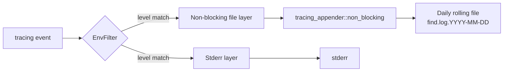

# Observability

The `find` tool emits structured events via the [`tracing`](https://docs.rs/tracing) ecosystem. Observability is designed to be non-blocking, scalable, and zero-impact on the search hot path.

## Tracing initialization

The tracing subscriber is initialized in [`src/main.rs::init_tracing`](../src/main.rs) at process startup. The returned `WorkerGuard` is held for the lifetime of the process; dropping it at exit flushes any buffered log events.

The subscriber stack:

1. **EnvFilter** — initialized from `RUST_LOG`, default `info`. See [configuration.md#rust_log-examples](configuration.md#rust_log-examples).
2. **Stderr layer** — `tracing_subscriber::fmt::layer().with_writer(std::io::stderr)`. Mirrors events to the terminal.
3. **Non-blocking file layer** — `tracing_subscriber::fmt::layer().with_writer(non_blocking).with_ansi(false)`. Writes to a daily-rolling file.



The non-blocking file writer is critical: it ensures that the I/O cost of writing log events does not enter the CPU-bound sweep thread. Each event is queued in a bounded buffer; the writer thread drains the queue asynchronously.

## Log levels

| Level | When used | Source |
|---|---|---|
| `error` | Recoverable errors that the process cannot continue past; e.g. checkpoint integrity violation | `src/persistence.rs::save_atomic`, `src/orchestrator.rs::run` |
| `warn` | Conditions that affect behavior but are not fatal; e.g. checkpoint pubkey mismatch, Rayon worker panic | `src/orchestrator.rs::run`, `src/search.rs::sweep_and_cache` |
| `info` | Lifecycle events: startup, segment boundaries, matches, audit boundaries | `src/main.rs::main`, `src/orchestrator.rs::run` |
| `debug` | Per-call events: pubkey parse, checkpoint load/save, cache miss/hit | `src/ecc.rs::parse_pubkey`, `src/orchestrator.rs::run` |
| `trace` | Per-batch events: scalar multiplication, batch normalization, cache writes | `src/search.rs::sweep_and_cache`, `src/persistence.rs::sweep_cached` |

`trace` level produces a very high volume of events and is intended for short diagnostic runs only. Running at `trace` for a long search will fill the disk quickly.

## Audit boundaries

The orchestrator emits a single `info!` event at every `32 × TRILLION = 3.2 × 10^13` scalar steps:

```
info!("Audit boundary: 32 trillion steps reached.");
```

This is the only progress signal in the steady state. Per-chunk progress is implicit in the cache-miss / cache-hit log lines; per-batch progress is emitted at the `debug` level.

Audit boundaries are **not** a hard milestone — they do not pause or checkpoint the search. They are intended to give long-running research a way to estimate progress from the log file alone.

## Lifecycle log events

| Event | Level | When |
|---|---|---|
| `Initializing find tool v<version>` | info | At startup |
| `Verified integrity. Resuming from j = <N>` | info | On successful checkpoint resume |
| `Checkpoint pubkey mismatch. Starting fresh.` | warn | When a checkpoint exists but its pubkey differs |
| `No valid checkpoint: <err>. Starting fresh.` | warn | When checkpoint load fails |
| `--- STARTING SEGMENT [<start> ... <end>] ---` | info | At the start of each chunk |
| `Cache hit: <path>` | info | When a cache file is found and reused |
| `Cache miss. Precomputing chunk...` | info | When `--cache-points` is enabled and the cache is absent |
| `Cache miss. Running parallel sweep...` | info | When the cache is absent and `--cache-points` is not set |
| `MATCH FOUND: <variant_label>` | info | When a `SearchMatch` is returned by the sweep |
| `Search space exhausted (overflow detected).` | info | When `current_j + CACHE_CHUNK_SIZE` saturates |
| `Search space exhausted.` | info | When `current_j == MAX_SEARCH` |
| `Audit boundary: 32 trillion steps reached.` | info | Every `32 × TRILLION` steps |
| `Rayon worker panicked` | error | When a worker thread panics (the panic is recovered by Rayon) |

## Rayon panic handling

The `rayon::ThreadPoolBuilder` is configured with a custom panic handler in [`src/main.rs::main`](../src/main.rs):

```rust
let _ = rayon::ThreadPoolBuilder::new()
    .panic_handler(|info| {
        let msg = info
            .downcast_ref::<&str>()
            .copied()
            .or_else(|| info.downcast_ref::<String>().map(|s| s.as_str()))
            .unwrap_or("unknown panic");
        tracing::error!(message = %msg, "Rayon worker panicked");
    })
    .build_global();
```

By default, a Rayon worker panic causes the entire process to abort. The custom handler logs the panic and continues. The hot path uses
[`OnceLock<SearchMatch>`](../optimization-decisions/0007-oncelock-early-exit.md)
for cross-batch coordination, which has **no mutex** to poison; the only
`Mutex` left in the application (`BinaryCacheWriter`'s non-Unix fallback
in `src/persistence.rs`) cannot be reached by the worker panics handled
here. This makes the tool more robust to transient worker errors at the
cost of potentially returning a partial result.

## Per-batch tracing (debug/trace only)

At the `debug` level, `src/ecc.rs::parse_pubkey` emits a single event per call. At the `trace` level, `src/search.rs::sweep_and_cache` emits events for every batch:

```
TRACE find::search: precompute batch 0/31250000
TRACE find::search: precompute batch 1/31250000
...
```

For a 1-billion-point cache, this is ~31 million events. Plan accordingly.

## Log file format

The daily-rolling file is named `find.log.YYYY-MM-DD` (e.g. `find.log.2026-04-12`). Each event is written on a separate line in the standard `tracing-subscriber` format:

```
2026-04-12T10:23:45.123Z INFO find::orchestrator: --- STARTING SEGMENT [1 ... 1000000000] ---
2026-04-12T10:23:45.456Z INFO find::orchestrator: Cache miss. Running parallel sweep...
2026-04-12T10:24:12.789Z INFO find::orchestrator: MATCH FOUND: 2^10
```

The format is greppable by timestamp, level, or module. See [operations.md#log-monitoring](operations.md#log-monitoring) for example queries.

## What is *not* logged

- **Per-scalar events.** Logging every `j·G` would be catastrophically slow. The trace-level log emits per-batch events only.
- **Internal state.** The variant index, the checkpoint anchor, and the progress counter are not logged. They are visible in the rustdoc-generated API documentation.
- **Public keys in full.** The pubkey is logged only at the `debug` level during `parse_pubkey`. Operators handling sensitive target keys should consider running with `RUST_LOG=info` to suppress this.

## See also

- [configuration.md](configuration.md) — `RUST_LOG` syntax
- [operations.md#log-monitoring](operations.md#log-monitoring) — production log queries
- [troubleshooting.md](troubleshooting.md) — common log messages and their meaning
